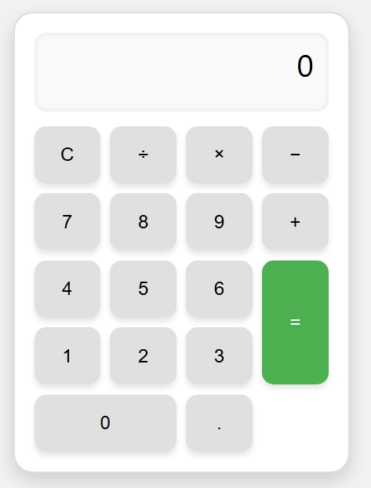

# Basic Calculator

This is a simple calculator built using HTML, CSS, and JavaScript.

## Screenshot

## Features
- Addition
- Subtraction
- Multiplication
- Division

## How to Run
Just open `index.html` in your browser.
